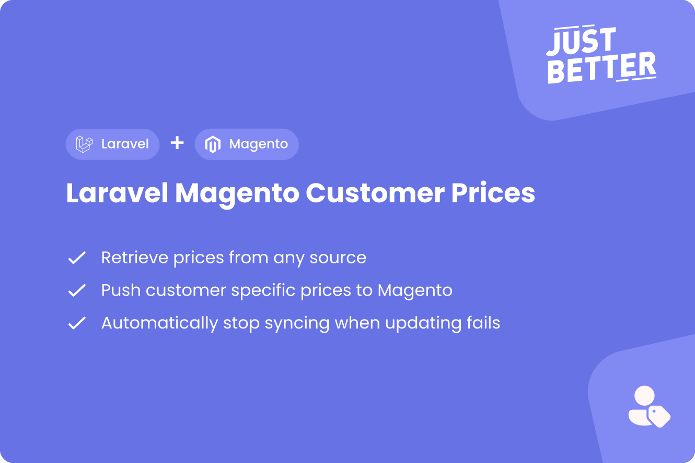

<a href="https://github.com/justbetter/laravel-magento-customer-prices" title="JustBetter">
    
</a>

# Laravel Magento Customer Prices

<p>
    <a href="https://github.com/justbetter/laravel-magento-customer-prices"></a>
    <a href="https://github.com/justbetter/laravel-magento-customer-prices"></a>
    <a href="https://github.com/justbetter/laravel-magento-customer-prices"></a>
    <a href="https://github.com/justbetter/laravel-magento-customer-prices"></a>
</p>

This package provides a way to add customer specific prices to Magento from a Laravel app.
By default, it uses the [JustBetter Magento 2 Customer Pricing](https://github.com/justbetter/magento2-customer-pricing) module for customer specific prices.
You can implement another customer specific price module, see [Updating Customer Prices](#magento-2-customer-prices).

## Features
This package can:

- Retrieve prices from any source
- Push customer specific prices to Magento
- Only update prices in Magento when are modified. i.e. when you retrieve the same price ten times it only updates once to Magento
- Automatically stop syncing when updating fails
- Logs activities using [Spatie activitylog](https://github.com/spatie/laravel-activitylog)
- Checks if Magento products exist using [JustBetter Magento Products](https://github.com/justbetter/laravel-magento-products)

> Check out [Laravel Magento Prices](https://github.com/justbetter/laravel-magento-prices) for connecting regular prices to Magneto
> We also have a [Magento Client](https://github.com/justbetter/laravel-magento-client) to easily connect Laravel to Magento!

## Installation

Require this package: `composer require justbetter/laravel-magento-customer-prices`

Publish the config
```
php artisan vendor:publish --provider="JustBetter\MagentoCustomerPrices\ServiceProvider" --tag="config"
```

Publish the activity log's migrations:
```
php artisan vendor:publish --provider="Spatie\Activitylog\ActivitylogServiceProvider" --tag="activitylog-migrations"
```

Run the migrations
```
php artisan migrate
```

### Laravel Nova

We have a [Laravel Nova integration](https://github.com/justbetter/laravel-magento-customer-prices-nova) for this package.


## Usage

Add the following commands to your scheduler:
```php
<?php

protected function schedule(Schedule $schedule): void
{
    $schedule->command(\JustBetter\MagentoCustomerPrices\Commands\ProcessCustomerPricesCommand::class)->everyMinute();

    // Retrieve all customer prices daily
    $schedule->command(\JustBetter\MagentoCustomerPrices\Commands\Retrieval\RetrieveAllCustomerPricesCommand::class)->daily();

    // Retrieve updated customer prices hourly
    $schedule->command(\JustBetter\MagentoCustomerPrices\Commands\Retriavel\RetrieveAllCustomerPricesCommand::class, ['from' => 'now - 1 hour'])->hourly();
}
```

### Retrieving Customer Prices

This package works with a repository that retrieves prices per SKU which you have to implement.

#### Repository

This class is responsible for retrieving prices for products, retrieving sku's and settings.
Your class must extend `\JustBetter\MagentoCustomerPrices\Repository\Repository` and implement the `retrieve` method.
If there is no price for the SKU you may return `null`. In all other cases you need to return a `CustomerPriceData` object which contains two elements:
- `sku` Required
- `prices` Optional, array of customer prices
  - `price` float of the price
  - `customer_id` Magento 2 customer id
  - `quantity` Minimum quantity

You can view the rules in the `CustomerPriceData` class to get an idea of what you need to provide.

##### Example

```php

<?php

namespace App\Integrations\MagentoCustomerPrices;

use JustBetter\MagentoCustomerPrices\Data\CustomerPriceData;
use JustBetter\MagentoCustomerPrices\Repository\Repository;

class MyCustomerPriceRepository extends Repository
{
  public function retrieve(string $sku): ?CustomerPriceData
    {
        return CustomerPriceData::of([
            'sku' => $sku,
            'prices' => [
                [
                    'customer_id' => 1,
                    'price' => 10,
                    'quantity' => 1,
                ],
                [
                    'customer_id' => 1,
                    'price' => 8,
                    'quantity' => 10,
                ],
            ],
        ]);
    }
}
```

### Retrieving SKU's

By default, the `Repository` that you are extending will retrieve the SKU's from [justbetter/laravel-magento-products](https://github.com/justbetter/laravel-magento-products).
If you wish to use this you have to add the commands to your scheduler to automatically import products.

If you have another source for your SKU's you may implement the `skus` method yourself.
It accepts an optional carbon instance to only retrieve modified stock.

```php
<?php

namespace App\Integrations\MagentoCustomerPrices;

use JustBetter\MagentoCustomerPrices\Repositories\Repository;
use Illuminate\Support\Carbon;
use Illuminate\Support\Collection;

class MyCustomerPriceRepository implements Repository
{
    public function skus(?Carbon $from = null): Collection
    {
        return collect(['sku_1', 'sku_2']);
    }
}
```

### Configuring the repository

The repository class has a couple of settings that you can adjust:

```php
class BaseRepository
{
    // How many prices may be retrieved at once when the process job runs
    protected int $retrieveLimit = 250;

    // How many prices may be updated at once when the process job runs
    protected int $updateLimit = 250;

    // How many times an update to Magento may fail before it stops trying
    protected int $failLimit = 3;
}
```

After you've created and configured the repository you have to set it in your configuration file:

```php
<?php

return [
    'repository' => \App\Integrations\MagentoCustomerPrices\MyPriceRepository::class,
];
```

## Magento 2 Customer Prices

By default, this package uses the [JustBetter Magento 2 Customer Pricing](https://github.com/justbetter/magento2-customer-pricing) module for updating prices to Magento.
If you use another Magento 2 module for customer specific pricing you can write your own class that updates prices in Magento.
You can do this by implementing  `JustBetter\MagentoCustomerPrices\Contracts\Update\UpdatesCustomerPrice`.
See `\JustBetter\MagentoCustomerPrices\Actions\Update\UpdateCustomerPrice` for an example.

Don't forget to bind your own class!
```
<?php

app()->singleton(\JustBetter\MagentoCustomerPrices\Contracts\Update\UpdatesCustomerPrice::class, YourCustomUpdater::class);
```

## Quality

To ensure the quality of this package, run the following command:

```shell
composer quality
```

This will execute three tasks:

1. Makes sure all tests are passed
2. Checks for any issues using static code analysis
3. Checks if the code is correctly formatted

## Contributing

Please see [CONTRIBUTING](.github/CONTRIBUTING.md) for details.

## Security Vulnerabilities

Please review [our security policy](../../security/policy) on how to report security vulnerabilities.

## Credits

- [Vincent Boon](https://github.com/VincentBean)
- [All Contributors](../../contributors)

## License

The MIT License (MIT). Please see [License File](LICENSE) for more information.

<a href="https://justbetter.nl" title="JustBetter">
    
</a>
